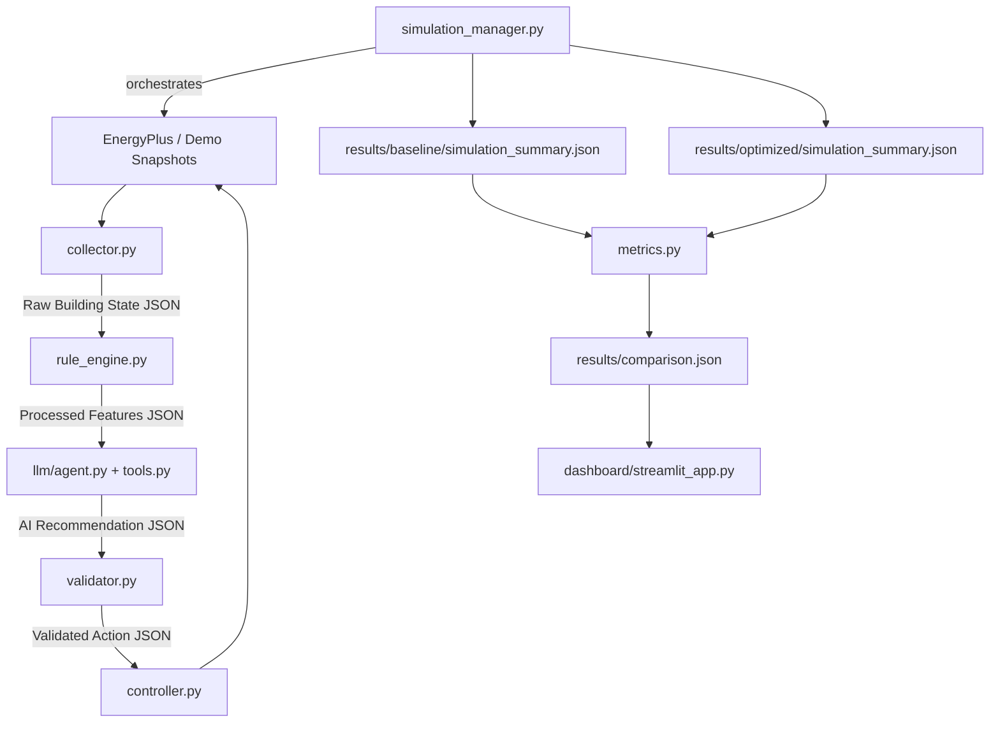

# 🌿 EcoLoop — AI Energy Optimization System

**AI-powered Building Energy Management System** that closes the loop between an EnergyPlus building simulation and an LLM-based control agent — optimizing HVAC and lighting energy while maintaining occupant comfort, with a quantitative baseline-vs-AI comparison.

> Full technical design, module responsibilities, and diagrams live in `[ARCHITECTURE.md](./ARCHITECTURE.md)`.

---

## Project Overview

EcoLoop runs two simulations of the same building — a fixed-setpoint **baseline** run and an **AI-optimized** run — and compares them side by side. A rule engine pre-processes raw sensor readings into concise features, an LLM agent (via Ollama/Qwen2.5) proposes cooling, heating, and lighting setpoints, a validator clamps those proposals to safe configured limits, and a controller applies the validated actions. Results from both runs are reduced to a single `comparison.json`, which a Streamlit dashboard visualizes for judges.

## Problem Statement

Buildings are a major source of energy consumption, and most HVAC systems run on static, conservative setpoints regardless of real-time occupancy or comfort conditions. Manually tuning setpoints for efficiency risks occupant discomfort, while ignoring optimization wastes energy. EcoLoop addresses this by using an LLM to reason over live building conditions and recommend setpoint adjustments, with deterministic safety validation guaranteeing the AI can never propose an unsafe or out-of-range action — and a baseline comparison to prove the savings are real.

## Features

- **Closed-loop AI control**: Collector → Rule Engine → LLM Agent → Validator → Controller pipeline per timestep.
- **Baseline vs. Optimized comparison**: Every run produces a `simulation_summary.json`; `metrics.py` reduces both into `results/comparison.json`.
- **Deterministic tool calling**: The LLM agent proposes actions through a fixed tool interface (`backend/tools.py`) rather than free-form text.
- **Safety validation layer**: `backend/validator.py` enforces HVAC/comfort limits from `config/building.yaml` before anything reaches the controller.
- **Demo mode**: `demo_mode: true` swaps live EnergyPlus sensor reads for prerecorded JSON snapshots, so the full pipeline (rule engine → agent → validator → controller) can run reliably offline.
- **Presentation-ready dashboard**: `dashboard/streamlit_app.py` renders KPIs, energy charts, comfort gauges, and AI recommendations from `comparison.json` only — no calculations happen in the dashboard.
- **Config-driven limits**: All thresholds (comfort range, PMV range, HVAC setpoint bounds, occupancy levels) live in YAML, not hardcoded in modules.


## System Workflow




See `[ARCHITECTURE.md](./ARCHITECTURE.md)` for the detailed sequence diagrams, prompt engineering strategy, and per-module design rationale.

## Project Structure

```
eco-loop/
├── backend/
│   ├── main.py               # Orchestrates baseline → optimized → metrics
│   ├── config.py             # YAML config loading + logging
│   ├── collector.py          # Raw building state (live or demo snapshot)
│   ├── rule_engine.py        # Deterministic feature extraction for the LLM
│   ├── validator.py          # Safety clamping of AI-proposed actions
│   ├── controller.py         # Applies validated actions to actuators
│   ├── simulation_manager.py # Simulation lifecycle + summary generation
│   ├── metrics.py            # Builds results/comparison.json
│   └── tools.py              # Tool-calling interface exposed to the LLM
├── llm/
│   ├── agent.py              # LLM reasoning / decision step
│   └── prompts.py            # System prompt
├── dashboard/
│   └── streamlit_app.py      # Read-only visualization of comparison.json
├── config/
│   ├── simulation.yaml       # EnergyPlus paths, demo_mode, retries
│   ├── building.yaml         # Comfort/HVAC/occupancy limits
│   └── llm.yaml              # LLM provider/model settings
├── energyplus/
│   ├── building.idf
│   └── weather.epw
├── results/
│   ├── baseline/
│   ├── optimized/
│   └── comparison.json
├── logs/
├── tests/
│   └── test_config.py
├── requirements.txt
├── README.md
└── ARCHITECTURE.md
```


## Technology Stack


| Layer               | Technology       |
| ------------------- | ---------------- |
| Building simulation | EnergyPlus       |
| Backend             | Python 3.11      |
| LLM provider        | Ollama (Qwen2.5) |
| Config format       | YAML (`PyYAML`)  |
| Dashboard           | Streamlit        |
| Testing             | pytest           |
| HTTP client         | requests         |


## Installation

1. Clone or download this repository.
2. Create and activate a virtual environment:
  ```powershell
   python -m venv .venv
   .venv\Scripts\Activate.ps1
  ```
3. Install dependencies:
  ```powershell
   pip install -r requirements.txt
  ```


## Configuration

All runtime settings live in `config/` as YAML files.

### `config/simulation.yaml`


| Key                       | Description                                                              |
| ------------------------- | ------------------------------------------------------------------------ |
| `energyplus_path`         | Path to the EnergyPlus executable                                        |
| `idf_path`                | Path to the building IDF file                                            |
| `weather_path`            | Path to the weather EPW file                                             |
| `output_directory`        | Directory for simulation outputs                                         |
| `demo_mode`               | When `true`, use prerecorded sensor snapshots instead of live EnergyPlus |
| `demo_snapshot_directory` | Directory for demo snapshot JSON files                                   |
| `max_retry`               | Maximum retry attempts on simulation failure                             |
| `timestep_interval`       | Control loop interval in minutes                                         |


### `config/building.yaml`


| Key                                   | Description                                 |
| ------------------------------------- | ------------------------------------------- |
| `min_temperature` / `max_temperature` | Acceptable indoor temperature range (°C)    |
| `min_pmv` / `max_pmv`                 | Acceptable PMV comfort range                |
| `occupancy_threshold`                 | Boundaries for low/medium occupancy         |
| `hvac_limits`                         | Min/max cooling and heating setpoint bounds |


### `config/llm.yaml`


| Key           | Description                |
| ------------- | -------------------------- |
| `provider`    | LLM provider (`ollama`)    |
| `model`       | Model name (`qwen2.5`)     |
| `temperature` | Sampling temperature       |
| `max_tokens`  | Maximum response tokens    |
| `timeout`     | Request timeout in seconds |


## How to Run

Run the full baseline → optimized → metrics pipeline:

```powershell
python backend/main.py
```

This runs the baseline simulation, runs the optimized (AI closed-loop) simulation, and invokes `metrics.py` to generate `results/comparison.json`.

Run the test suite:

```powershell
python -m pytest tests/test_config.py -v
```


## Dashboard & Results

Launch the dashboard to visualize the latest `results/comparison.json`:

```powershell
streamlit run dashboard/streamlit_app.py
```

The dashboard displays baseline vs. optimized energy KPIs, an energy comparison chart, an energy savings donut chart, temperature/PMV comfort gauges, and the AI's recommendations — all read directly from `comparison.json`, with no calculations performed in the dashboard itself.


## Future Improvements

- Live EnergyPlus output parsing for finer-grained, time-series metrics.
- Carbon-intensity-aware scheduling using a live grid API.
- Multi-building and multi-zone optimization.
- Persisting historical runs to a database for trend analysis across sessions.
- REST API layer for integration with external building management systems.

