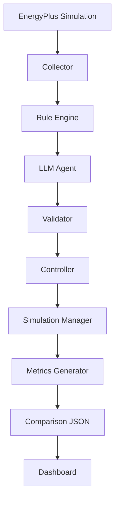
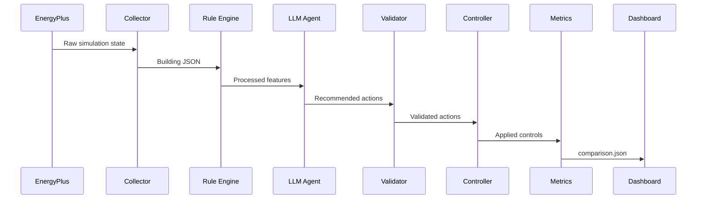
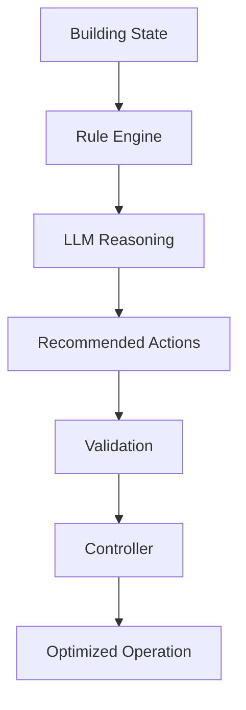

# 🌿 EcoLoop — AI Energy Optimization System: System Architecture

## Overview

EcoLoop is an AI-driven closed-loop building energy optimization system that integrates EnergyPlus building simulation with a Large Language Model (LLM) agent. The system continuously analyzes building operating conditions, generates intelligent control recommendations, validates them against safety constraints, and estimates the resulting energy savings while maintaining occupant thermal comfort.

The architecture is designed around modular components communicating through structured JSON, allowing each stage of the pipeline to remain independent, testable, and easily extensible.

---

# Objectives
* Reduce building energy consumption.
* Maintain occupant thermal comfort.
* Demonstrate autonomous AI-driven control.
* Provide explainable optimization decisions.
* Generate quantitative comparisons between baseline and optimized operation.
---

# High-Level System Architecture

---

# End-to-End Workflow
1. The **Simulation Manager**: launches a baseline EnergyPlus simulation.
2. The **Collector**: extracts relevant building state information.
3. The **Rule Engine**: converts raw simulation data into compact AI-friendly features.
4. The **LLM Agent**: receives the summarized building state and generates optimization recommendations.
5. The **Validator**: ensures every recommendation satisfies operational constraints.
6. The **Controller**: records validated actions and applies the optimized operating strategy.
7. The **Simulation Manager**: generates optimized run metrics.
8. The **Metrics Generator**: compares baseline and optimized performance.
9. The **Dashboard**: visualizes energy savings, comfort metrics, runtime, and AI recommendations.
---

# Component Responsibilities
## Configuration Manager
Responsible for loading all project configuration files.

Responsibilities:

* Building configuration
* Simulation configuration
* LLM configuration
* Logging configuration
* Directory initialization
---

## Simulation Manager
Acts as the orchestrator for the complete optimization pipeline.

Responsibilities:
* Execute baseline simulation
* Execute optimized simulation
* Coordinate all backend modules
* Generate simulation summaries
* Measure runtime
* Persist simulation outputs
---

## Collector
The Collector serves as the interface between EnergyPlus and the AI pipeline.

Responsibilities:
* Read simulation outputs
* Extract relevant building state
* Support demo mode snapshots
* Produce structured JSON

Example extracted information:
* Zone temperature
* HVAC energy
* Occupancy
* PMV
* Lighting load
---

## Rule Engine

The Rule Engine converts raw simulation data into semantic building features.

Instead of exposing raw simulation logs to the language model, it generates concise, meaningful descriptors such as:

* High occupancy
* Comfort maintained
* High cooling demand
* Elevated energy usage
* Carbon intensity level
This dramatically reduces prompt size while improving inference quality.
---

## LLM Agent
The LLM Agent performs autonomous reasoning over the processed building state.

Responsibilities:
* Analyze building conditions
* Generate optimization recommendations
* Select appropriate control tools
* Return structured JSON actions

Example recommendations include:
* Increase cooling setpoint
* Reduce lighting intensity
* Adjust heating setpoint
---

# Tool-Calling Architecture
The project follows a deterministic tool-calling workflow.

The LLM never modifies the simulation directly.
Instead, it proposes actions which are executed only after validation.
This separation improves reliability and prevents unsafe recommendations from reaching the building control layer.

---

# Prompt Engineering Strategy
The LLM operates only on summarized building information rather than raw EnergyPlus outputs.

Prompt design focuses on:
* Current occupancy
* Temperature
* PMV
* HVAC energy
* Lighting status
* Comfort category
* Energy usage category

The model returns structured recommendations instead of free-form text, simplifying downstream processing.

---

# Prompt Latency Optimization

To minimize inference latency:
* Only processed features are sent to the LLM.
* Raw simulation files are never included.
* Prompts remain compact and deterministic.
* One inference is performed per optimization cycle.
* JSON communication eliminates unnecessary parsing.

These decisions significantly reduce prompt size while maintaining recommendation quality.

---

# Handling Long EnergyPlus Simulation Logs

EnergyPlus generates large output files including:
* CSV
* ESO
* XML
* HTML
* ERR

Passing these files directly to an LLM would increase token usage and latency.
Instead, EcoLoop performs local preprocessing.
The Collector extracts only essential variables.
The Rule Engine summarizes these into compact semantic features.
The LLM therefore operates on structured building intelligence rather than lengthy simulation logs.

---

# JSON Communication Flow
Each module communicates using structured JSON.

This modular communication allows individual components to be replaced without affecting the rest of the pipeline.

---

# Safety & Validation Layer
A dedicated validation stage sits between the AI and the controller.

Responsibilities include:
* Cooling setpoint limits
* Heating setpoint limits
* Lighting bounds
* Safety rule enforcement
* Action correction
* Audit logging

This prevents unsafe AI-generated actions from reaching the building control system.

---

# AI Decision Pipeline

---

# Metrics Generation
Instead of parsing complex EnergyPlus output formats, EcoLoop generates structured simulation summaries for each run.
Generated artifacts include:

* `baseline/simulation_summary.json`
* `optimized/simulation_summary.json`
* `comparison.json`

The Metrics Generator compares both runs and computes:
* Total energy consumption
* HVAC energy
* Average temperature
* PMV
* Runtime
* Estimated energy savings
* Comfort preservation

These metrics are consumed directly by the Streamlit dashboard.

---

# Technology Stack

| Layer                | Technology     |
| -------------------- | -------------- |
| Programming Language | Python         |
| Building Simulation  | EnergyPlus     |
| AI Agent             | Ollama / LLM   |
| Backend              | Python         |
| Configuration        | YAML           |
| Communication        | JSON           |
| Dashboard            | Streamlit      |
| Visualization        | Plotly         |
| Logging              | Python Logging |

---

# Key Design Decisions

* Modular architecture with clear separation of responsibilities.
* JSON-based communication between all components.
* Deterministic tool-calling workflow.
* Validator layer before controller execution.
* Lightweight prompts using summarized features.
* Independent dashboard consuming standardized metrics.
* Replaceable AI and simulation components for future scalability.
---

# Future Improvements
Future versions of EcoLoop can extend the current architecture by:
* Integrating the EnergyPlus Runtime API for live actuator control.
* Supporting real-time streaming sensor data.
* Replacing estimated optimization metrics with direct EnergyPlus feedback.
* Introducing multi-agent coordination for HVAC, lighting, and occupancy optimization.
* Learning adaptive control policies using reinforcement learning.
* Incorporating weather forecasts and dynamic electricity pricing for predictive optimization.
---
# Conclusion
EcoLoop demonstrates a modular, explainable, and AI-driven approach to autonomous building energy optimization. By combining EnergyPlus simulation, structured feature engineering, deterministic LLM tool-calling, safety validation, and an interactive analytics dashboard, the system provides a complete proof-of-concept for intelligent closed-loop building control while remaining scalable for future real-world deployment.
